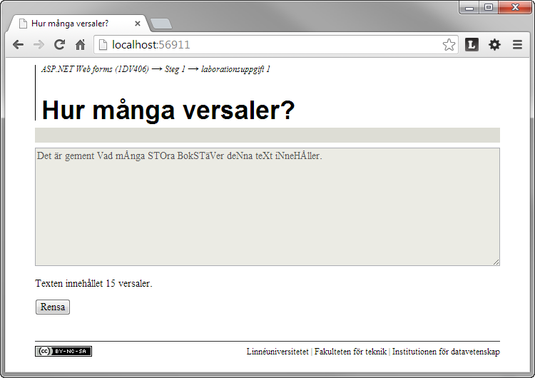

1.1 Hur många versaler?
=======================
[1-1-hur-manga-versaler.pdf](https://github.com/1dv406/kursmaterial/raw/master/Laborationsuppgifter/1-1-hur-manga-versaler.pdf)

"Skriv en webbapplikation bestående av en sida där användaren kan mata in en text. Texten ska analyseras och antalet inmatade versaler (stora bokstäver) ska bestämmas och presenteras."
